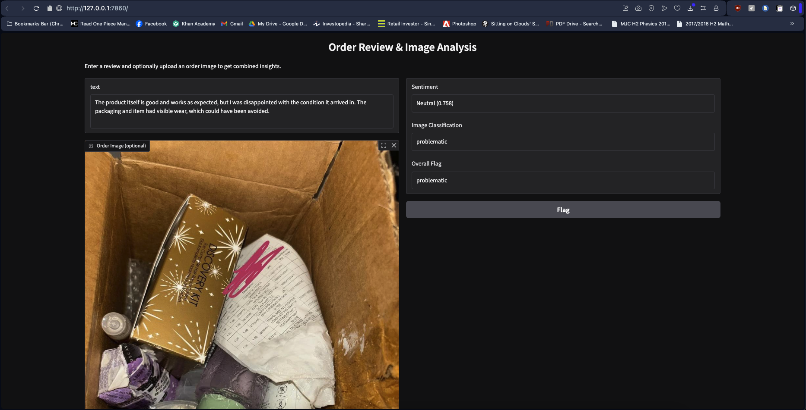

# BC3415 Individual Assignment README

For the individual assignment, we are working on behalf of a major online retail company, who receives thousands of product reviews everyday, consisting of text and customer uploaded images (optional). The company wants us to perform the following tasks:

- Classify text reviews into sentiment categories (positive, negative, neutral)
- Detect product defects or misdeliveries from customer-uploaded images
- Combine both types of information to automatically flag problematic orders

Hence, this assignment will be completed in 2 parts, using 2 notebooks for text sentiment analysis and flagging problematic orders from images.

Video Demo & Explanation: https://youtu.be/zxiGd7zu1EQ

## 1 Usage Instructions

### 1.1 Running the Demo Directly

**Dependencies & Virtual Env Setup**
Before running the solution, you must also first create a Python Virtual Environment to serve as the Kernel. I used Python 3.10.15. It is also recommended to pip install all the dependencies in the 2 notebooks to avoid any dependencies errors.

**Running the Model Deployment Section**
To use the demo directly without training your own model weights, please run the last section labelled **Model Deployment** in the 2nd notebook, BC3415_Individual_Assignment_Image_Classification.ipynb as shown below:

**Using the Deployment Demo**
After running the entire section, you should see an instance of the model running as shown below, and you can click on the link to use the local instance running in the browser:

### 1.2 Training directly to obtain the model weights

#### Dependencies

Before running any notebooks, you must first create a Python Virtual Environment to serve as the Kernel. I used Python 3.10.15 and installed all the packages in the 2 notebooks with pip install. Before running the 2nd notebook, do note to change the filepaths to a location with sufficient space as training of models take a lot of time and storage. I had to use an external SSD, which is why it is necessary to change pathsThis repository contains 2 notebooks for completing the task and should be run in the following order:

#### Notebook Run Order

1. BC3415_Individual_Assignment_Text_Sentiment_Analysis.ipynb
2. BC3415_Individual_Assignment_Image_Classification.ipynb

The notebooks are run in the following manner as the first notebook creates the best text sentiment analysis model available, while the second notebook uses the text model after training an image model.

The demo is found inside the second notebook and is deployed using Gradio. An example of the models in action is shown below. Take note that uploading an image is optional, only the textual review is important.

**Insights**
Note that the text sentiment takes priority due to ambiguity with images in the dataset as explained below. Hence, the order flagging logic is as follows:

- If the text sentiment is negative, mark the order as problematic.
- If the text is neutral but the image suggests an issue, also flag it as problematic.
- Otherwise, it’s marked as not_problematic.

## 2 Models Used

### 2.1 Text Sentiment Analysis - BC3415_Individual_Assignment_Text_Sentiment_Analysis.ipynb

The sentiments are allocated as such:

- Review Rating <= 2: Negative
- Review Rating == 3: Neutral
- Review Rating >= 4: Positive

The first notebooks trains 2 text sentiment analysis models, namely the Naives Bayes and a minimal BERT model over the Amazon Review Dataset. However, due to the size of the dataset, I only used reviews from the Beauty Product category.

I was able to train the Naives Bayes on the entire 700k reviews as it is a classical machine learning model and not deep learning and does not take as much effort to train. However, for the BERT model, I used the same dataset and retrieved a subset of 3 varying sizes to train:

- Small: 5k train datapoints and 500 test datapoints
- Medium: 20k train points and 2k test points
- Large: 50k train and 5k test

### 2.2 Image Classification - BC3415_Individual_Assignment_Image_Classification.ipynb

I used the same Amazon Beauty dataset for the Image Classification task. The dataset was obtained by filtering the dataset for rows where the customer have uploaded images alongside their reviews. The labels are categorised as such:

- Review Rating <= 2: Problematic Orders
- Review Rating == 3: Uncertain
- Review Rating >= 4: Not Problematic

However, I noticed that the images might not reflect the label accurately sometimes. For instance, a customer had uploaded an image of their foot for a review of 5 stars. In fact, many of the images uploaded for problematic and unproblematic orders were similar, usually depicting an image of the customer or the product itself.

The only exception are damaged shipping where images of damaged boxes will be shown and the review rating tends to be low to reflect the dissatisfaction.

## 3 Results

### 3.1 Text Sentiment Analysis

#### Model 1: Naive Bayes

1. Concatenating review title & body
   
2. Not concatenating review title & body
   

**Conclusions:**

- Naives Bayes is able to achieve relatively high accuracy in text sentiment due to being able to train on the entire dataset, near 90%.
- Fast in training
- Not concatenating helps improve accuracy.

#### Model 2: DistilBERT Model

##### Concatenating Review Title & Body Text

1. Small Dataset + 3 Epochs
   

2. Small Dataset + 6 Epochs
   

**Conclusions about the Number of Epochs:**

- For relatively small datasets, we can conclude that 3 epochs is ideal for training our model. This is because the accuracy stops increasing, and even falls afterwards.
- However, we can see that validation loss did not decrease as well as shown above. This is a sign of overfitting which indicates that our training dataset used might be too small.

3. Medium Dataset + 3 Epochs
   

4. Large Dataset + 3 Epochs
   

##### Not Concatenating Review Title & Body Text

1. Small Dataset + 3 Epochs
   
2. Medium Dataset + 3 Epochs
   
3. Large Dataset + 3 Epochs
   

**Analysis:**

- We note that when the number of epochs and model being used to train is held constant, not concatenating the review body and title leads to higher model accuracy, validating our results from using a Naives Bayes model.
- Number of epochs used is sufficient since it shows that we minimised validation loss before it started to rise again.
- Accuracy has also plateaued.
- Final solution should use model trained from separate review title and body.

### 3.2 Image Classification

#### Model 1: CNN Results

#### Model 2: VIT Results

